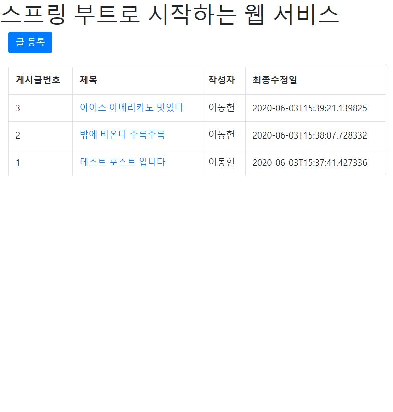
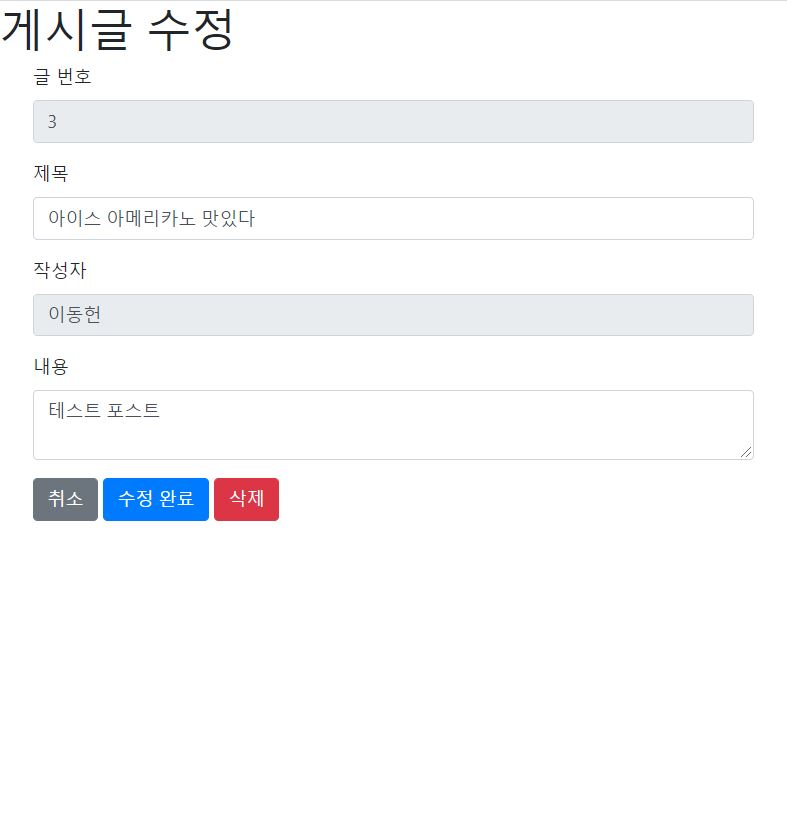

# 스프링 부트와 AWS로 구현하는 웹 서비스
## 구현해야 할 목록
- 프로젝트에 JPA 적용하기 V
  - 잘 동작하는 지 테스트 코드 작성 V
- 게시글 관련 요청 처리하는 Controller 및 Service 구현 V
  - 게시글 저장 API 구현 V
  - 게시글 수정 API 구현 V
  - 게시글 조회 API 구현 V
  - 각 요청에 대한 테스트 코드 작성 V
- JPA Auditing으로 생성시간, 수정시간 자동화하기 V
  - 잘 동작하는 지 테스트 코드 작성 V
- 화면 구성 (Mustache) V
  - index 페이지 작성 V
  - 게시글 등록 화면 작성 V
  - 전체 게시글 조회 화면 작성 V
  - 게시글 수정, 삭제 화면 작성 V
- 로그인 기능 구현하기 
  - ***레퍼런스 코드를 참고하여 구현은 했으나, spring security 부분 매우 어려우니 꼭 다시 한 번 공부할 것.***

## 현재 상황
## screenshot

  
  

# 개발 환경
- 개발 언어: Java
- 프레임워크: Spring boot, Spring data jpa
- 데이터베이스: Google Cloud Platform SQL (MySQL)
